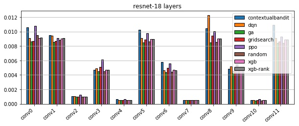
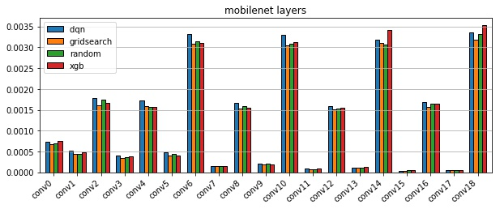

# TVM Scheduling with Reinforcement Learning 

Qijing Huang,        Hasan Genc,        Ameer Haj-Ali 

## 1. Introduction

Deep neural network(DNN) are widely adopted to support many diverse applications, such as computer vision, natural language processing, and click prediction. Big cloud vendors like Google, Facebook and Amazon all have started to develop ASIC chips for DNN inferencing. Previously, the compiler stacks that map DNNs to various emerging AI chips are very ad-hoc. There are ~85 AI chip companies in the world [1]. If everyone of them designs their own accelerator with different architecture and micro-instruction support, developing the software stack tailored to each architecture requires huge man power.TVM [2] provides a general tensor expression intermediate representation (IR) between the DNN frameworks and the hardware architecture to support automatic code generation. During the code generation, scheduling plays an important role in improving the final accelerator utilization and performance, especially for general-purpose systolic array design like TPU, NVDLA and Eyeriss. TPU paper [3] shows that four of the six DNN applications are memory-bound. This means if the compiler finds an optimal schedule that maximizes the data reuse, the performance of a deep learning accelerator can be improved significantly. 

Previously, blackbox algorithms[4] are widely used in the compiler domain to search for a good schedule. However, such approach can be time-consuming as tuning is required for every new task and the search space grows exponentially with the number of knobs. Recent advancements in reinforcement learning offer opportunities to address this problem by training a smart agent that takes advantage of prior knowledge to direct the search. 

<p align="center">

<br>
<em>TVM Stack</em>
</p>

In this project, we:
* Formulated the scheduling problem in RL and implemented an RL scheduler 
* Applied several deep RL algorithms:
    1. Multi-steps Approach with Proximal Policy Optimization and Deep Q-network
    2. One-step Approach with Contextual Bandits Algorithm 
* Analyzed and compared the performance of RL against xgboost, random, gridsearch, and genetic algorithms 

With the TVM IR and its open-source hardware accelerator design VTA [5], we also see an opportunity to co-tune the scheduling and hardware architecture parameters for different neural network designs to optimize for inference speed and other design metrics such as power and area.  However, this is left to future research. 

## 2. Related Work
TVM tuner [[6]](https://arxiv.org/pdf/1805.08166.pdf) build a statistical cost model to estimate the cost of each low-level program based domain-specific features from a low-level abstract syntax tree (AST). The features include loop structure information, buffer reuse ratio and etcs. [[6]](https://arxiv.org/pdf/1805.08166.pdf) also has evaluated the TreeRNN [[7]](https://www.aclweb.org/anthology/P15-1150) methods to predict the cost from AST. Once the cost model is ready, the tuner uses the cost model to pick promising configurations and a parallel simulated annealing algorithm [8] to search for a good design point. Other relevant work includes OpenTuner [[4]](https://groups.csail.mit.edu/commit/papers/2014/ansel-pact14-opentuner.pdf), and Halide’s autotuners [[9]](http://graphics.cs.cmu.edu/projects/halidesched/mullapudi16_halidesched.pdf). OpenTuner uses an AUC-Bandit-meta-technique to direct the emsemble selection of algorithms (Differential Evolution, Genetic Algorithms, Multi-arm bandits, Pattern Search, Pseudo Annealing, Particle Swarm Optimization and etc). It is a blackbox algorithm without leveraging observations from the program. Halide’s original tuner uses stochastic search with a genetic algorithm and later changes to a greedy search guided by higher-level heuristics with function bounds analysis. Latest Halide tuner incorporates beam search that explores a graph by expanding the most promising node in a limited set.    

## 3. Problem Formulation
### 3.1 Reinforcement Learning Algorithms (PPO, DQN, Contextual Bandits) 
**Reinforcement learning (RL)**[10] is an effective machine learning approach for solving Markov Decision Processes (MDPs). 
In RL, at each timestep t, the agent observes the environment output consisting of a state , and based on the observation, takes an action . 
The environment also returns  which is a reward from taking the action  in state  .  The goal of RL is to learn a policy  to optimize for the accumulated expected reward **E** under the marginal distribution of the state-action pair . An RL problem with finite horizon can be formulated as follows: 
<p align="center">

</p>

**Policy Gradient**[11] learns the transition policy  that predicts the best action to take given an optimization state by directly differentiating the objective function above and performing a stochastic gradient ascent to maximize the aggregated expected reward **E**. The gradient can be expressed as:
<p align="center">

</p>

**Proximal Policy Optimization (PPO)**[12] is a variant of Policy Gradient. Unlike other standard policy gradient methods that update the gradient per data sample, PPO allows multiple epochs of minibatch updates and thus has better sample efficiency. 
PPO performs updates that minimizes the cost function while ensuring the deviation from the previous policy is small by adding a penalty in the objective function. Its loss function is defined as:
<p align="center">

</p>

where  is defined as a probability ratio  so . This term penalizes policy update that move $r_t(\theta)$ from $r(\theta_{old})$.  is the advantage estimator that approximates how good  is compared to the average. The second term in the  function acts as a disincentive for moving  outside of  where  is a hyperparameter. 

**Deep Q-network (DQN)**[13] is an off-policy method which takes partially random actions to explore the state space. The DQN's goal is to find which actions will maximize future rewards from a given state. DQN computes a Q-function,  that predicts the future overall reward of taking action  from state . To compute this Q-function, DQN uses a neural network paramterized by weights ). Formally:
<p align="center">
 
</p>

where  is the target result,  and  are the current action and state respectively,  and  are the next action and state respectively, and  is the reward for taking action  at state . The policy is basically defined as follow:
<p align="center">


</p>

**Contextual Bandits(CB)** 
Unlike the multi-armed bandit algorithm which outputs an action to test without any knowledge aboutthe state of the environment, contextual bandits outputs an action conditional on the state of the environment.
We set the horizon to 1 and  to 0 in PPO from Ray to implement contextual bandits. 


### 3.2 Our RL Framework 
The figure below shows the system diagram of our framework. For convolution layer on x86 CPU, there are four knobs exposed by the [kernel template](https://github.com/hqjenny/ktune/blob/fa0863bd90ff108eed16ec095cf3da27d8d9399b/topi/python/topi/x86/conv2d.py#L255): 
*tile_ic*, *tile_oc*, *tile_ow*, and *unroll_kw*. *tile_x* sets the tile size for different loop dimension. *unroll_x* sets whether to unroll a loop. 

<p align="center">
  

<br>
<em>System Diagram</em>
</p>
Detailed implementation of our RL environment for TVM can be found [here](https://github.com/hqjenny/ktune/blob/master/python/tvm/autotvm/tuner/tvm_env.py). 

#### Action Space  

An RL agent takes actions to maximize the expected rewards. In this work, we experiment with two approaches to define the action and formulate the problem:
1. In the **Multi-steps Approach**, our action space  is defined as  where *N* is the number of knobs. 
Upon the start of training, the RL agent resets all the configurations to one of the following:
    1. all zeros 
    2. random values 
    3. median values.
    
It then observes the current specifications and decides to either stay still or move upand down for each knob. The configuration is thus defined as  where . We set the horizon length to 20 as there are less than 20 configurations per knob in geneneral in TVM for the convolutional layers. The configuration space can be significantly larger if a remainder is allowed in the loop split. However, AutoTVM default configuration space currently does not support it. 

2. In the **One-step Approach** like the contextual bandits, we define our action as  where  for .  The horizon length is set to 1 in this case as we are not leveraging any information from past actions. 

#### Observation Space
Once the RL agent predicts a new action and interfaces with environment, a new scheduling configuration is generated.The generated design specification is then used as an observation to the RL agent. We use the three different features offered by tvm as observations in this problem. 

1. [Knob Features](https://github.com/hqjenny/ktune/blob/52d5cf89dbb856efd2ac771dd3a1c4cb4ebcded0/python/tvm/autotvm/task/space.py#L799) are extracted from current knob configs. The following is an example knob feature vector `[('tile_ic', [64, 1]), ('tile_oc', [8, 8]), ('tile_ow', [7, 8]), ('unroll_kw', True)]`.

2. [Curve Features](https://github.com/hqjenny/ktune/blob/52d5cf89dbb856efd2ac771dd3a1c4cb4ebcded0/src/autotvm/touch_extractor.cc#L358) are extracted by [sampling relation curve](https://github.com/hqjenny/ktune/blob/fa0863bd90ff108eed16ec095cf3da27d8d9399b/src/autotvm/touch_extractor.cc#L434), which is invariant of loop structure. There are four different curves being sampled `reuse_curve, count_curve, topdown_curve, bottomup_curve`. 

3. [Itervar](https://github.com/hqjenny/ktune/blob/52d5cf89dbb856efd2ac771dd3a1c4cb4ebcded0/src/autotvm/touch_extractor.cc#L180) are extracted based on loop iteration variables. The format of return value is as follows:
```
 * ((
 *   ('_itervar_',  var),
 *   ('_attr_',     length, nest_level, topdown, bottomup, one_hot_annotation),
 *   ('_arith_',    add_ct, mul_ct, div_ct),
 *   ('data_vec_0', stride, mod, count, reuse, thread_count, thread_reuse),
 *   ('conv_0',     stride, mod, count, reuse, thread_count, thread_reuse),
 * ),
 * (
 *   ('_itervar_',    var2),
 *   ('_attr_',       length, nest_level, one_hot_annotation),
 *   ('_arith_',      add_ct, mul_ct, div_ct),
 *   ('kernel_vec_0', stride, mod, count, reuse, thread_count, thread_reuse),
 *   ('conv_1',       stride, mod, count, reuse, thread_count, thread_reuse),
 * ))
```
[This feature file](https://raw.githubusercontent.com/hqjenny/ktune/master/scripts/features/resnet-18-5-feat.txt?token=ACEPQUI5UWHVS5TWNLAA42K44OHXA) lists all the feature names for *resnet-15* layer 5. 

#### Reward Function 
While taking actions the agent receives rewards to help understand whether the action taken was effective or not. For each layer, we measure its execution time  given a schedule. 
Our reward function is defined as:
<p align="center">

</p>
  
This reward increases as the RL agent achieves design specifications closer to the target specification.

## 4. Results
We use RLlib[14] and Ray[15] to implement and run the reinforcement learning algorithms. The target platform for testing performance is Intel E5-2680v2 CPU running at 2.8GHz. The DNN inference time is measured using TVM standard [time evaluation function](https://github.com/hqjenny/ktune/blob/fa0863bd90ff108eed16ec095cf3da27d8d9399b/src/runtime/rpc/rpc_module.cc#L199). 

### 4.1 GridSearch Results 
We first perform a gridsearch for the 1st layer of *ResNet-18*. By visualizing the results, we are able to identify several regions with good inference latency. The figure below shows that, when the kernel is fully unrolled, a low tiling factor for the input width dimension will lead to bad schedule (timeout). However, it is not the case when the inner kernel is not unrolled. 
<p align="center">
 
<br>
<em>unroll_kw=True</em>
</p>

<p align="center">


<br>
<em>unroll_kw=False</em>
</p>
  
### 4.2 Learning Curve
In this section, the learning curves for all the reinforcement learning algorithms are shown. The mean and max rewards for most of the trajectories are increasing with a few exceptions running PPO. Both **Multi-steps Approach** (DQN and PPO) and **One-step Approach** (Contextual Bandits) learns to avoid bad schedules that leads to a timeout during inference. 

#### 4.2.1 **DQN**
<p align="center">
  
<br>
<em>DQN Reward Mean and DQN Reward Max</em>
</p>

#### 4.2.2 **PPO**
<p align="center">
  
<br>
<em>PPO Reward Mean and PPO Reward Max</em>
</p>

#### 4.2.3 **Contextual Bandits**
<p align="center">
  
<br>
<em>CB Reward Mean and CB Reward Max</em>
</p> 


### 4.3 Comparison 
This section shows a comparison among all commonly used algorithms and RL. 
The *default* performance  
We use the default settings for random, xgb, xgb-rank and ga in TVM. It turned out all algorithms are set up to run for equal or more than the total number of configuration times.  We run our RL algorithms (DQN, PPO, Contextual Bandits) with much fewer samples and achieve competitive results. For SqueezeNet_v1.1, Contextual Bandits and PPO achieve similar performance as xgb with half the samples. We did not run RL for more episodes mainly due to a unresolved thread hanging issue that running Ray. 

#### 4.3.1 **ResNet-18**
  

| gridsearch | random | xgb   | xgb-rank | ga   | ppo  | dqn  | contextualbandit | default |
|------------|--------|-------|----------|------|------|------|------------------|---------|
| 6852       | 6852   | 12446 | 12446    | 6852 | 2400 | 2400 | 600              | 1       |

<p align="center"> <em>Sample Size</em> </p> 


#### 4.3.2 **SqueezeNet_v1.1**
  

| xgb  | random | ppo  | dqn  | contextualbandit | default |
|------|--------|------|------|------------------|---------|
| 6988 | 6988   | 3600 | 3600 | 2065             | 1       |

&nbsp;&nbsp;&nbsp;&nbsp;&nbsp;<em>Sample Size</em>

#### 4.3.3 **MobileNet**
  
 
| xgb   | random | gridsearch | dqn  |
|-------|--------|------------|------|
| 10436 | 10476  | 10436      | 1539 |

 &nbsp;&nbsp;&nbsp;&nbsp;&nbsp;<em>Sample Size</em> 
 
#### 4.4 Generalization  
In the results above, as the features we use do not have the same shape for different layers, a new agent is trained for each layer.  In the section, we use only the *knob features* with fixed size and train one agent to direct the search for all resnet-18 layers. The following figures show the learning curve of the RL agent across the first 5 layers. The tensor shape of the layers are as follows: `[1, 3, 224, 224]`, `[1, 64, 56, 56]`, `[1, 64, 56, 56]`, `[1, 128, 28, 28]`, `[1, 128, 28, 28]`. The mean and max episode rewards converges faster for the latter layers. The results show that, trained with information from the previous layers,  the agent learns to walk towards a good configuration point starting from a random initial position since the first episode.

<p align="center">
  
<br>
<em>DQN Reward Mean and DQN Reward Max</em>
</p>

The images below show the best tuning performance of five different algorithms versus the number of trials. We used the same RL agent and train the agent on each layer for ~200 trials starting from conv layer 0. RL converges faster than other algorithms on a few layers such as *1-64-56-56-128-64-1-1*, *1-256-14-14-512-256-3-3.csv*, *1-128-28-28-128-128-3-3* and *1-256-14-14-512-256-3-3*.  
<p align="center">
 
<br>
<em>Tuning performance vs number of trials</em>
</p>
  
## 5. Conclusion 
In this work, we show that, RL achieves reasonable schedules with much fewer samples compared to other algorithms. We also demonstrate the potential to generalize the RL for new unseen layers to further reduce the sample size. 

## 6. Future Work 

To improve the efficiency of RL and to make the agent more generalizable, we plan to: 
* Add more fixed-size features using more feedback from the runs (e.g. cache miss rates, cpu utilization and etcs.)
* Add the history of configurations as features 
* Use decision trees with RL  
* Add embedding/PCA to the features

In addition, we plan to train the agent for more episodes on one network and perform 
Next major goal of the project is to co-tune the hardware accelerator architecture with the schedule. 
Detailed steps include:
* Add the hardward configurations (# of PEs, BRAM sizes) as features to the RL agent
* Use an RL agent to explore and find good hardware configurations together with good schedules

In this project, we've set up an embedded FPGA to run matrix multiplications with default scheduling, but were not able to tune the VTA schedule due to time limit. 


## 7. Current Issues 
1. The Ray threads often randomly hang. We tried calling Ray Tune from new Python Threads as in [rl_tuner.py](https://github.com/hqjenny/ktune/blob/7427bded445497a3c90ff78b47aab8e1f80d79e7/python/tvm/autotvm/tuner/rl_tuner.py#L45), but it only alleviated the problem.  
2. The [curve features](https://github.com/hqjenny/ktune/blob/52d5cf89dbb856efd2ac771dd3a1c4cb4ebcded0/src/autotvm/touch_extractor.cc#L358) do not have a fixed size for different layers as we hoped, which makes them not usable for generalization currently. 


## References

[1] “A list of ICs and IPs for AI, Machine Learning and Deep Learning” . https://github.com/basicmi/AI-Chip.

[2] Chen, Tianqi, et al. "TVM: An Automated End-to-End Optimizing Compiler for Deep Learning." 13th USENIX Symposium on Operating Systems Design and Implementation (OSDI 18). 2018.

[3] Jouppi, Norman P., et al. "In-datacenter performance analysis of a tensor processing unit." 2017 ACM/IEEE 44th Annual International Symposium on Computer Architecture (ISCA). IEEE, 2017.

[4] Ansel, Jason, et al. "Opentuner: An extensible framework for program autotuning." Proceedings of the 23rd international conference on Parallel architectures and compilation. ACM, 2014.

[5] Moreau, Thierry, et al. "VTA: An Open Hardware-Software Stack for Deep Learning." arXiv preprint arXiv:1807.04188(2018).

[6] Chen, Tianqi, et al. "Learning to optimize tensor programs." Advances in Neural Information Processing Systems. 2018.

[7] Tai, Kai Sheng, Richard Socher, and Christopher D. Manning. "Improved semantic representations from tree-structured long short-term memory networks." arXiv preprint arXiv:1503.00075 (2015)

[8]Kirkpatrick, Scott, C. Daniel Gelatt, and Mario P. Vecchi. "Optimization by simulated annealing." science 220.4598 (1983): 671-680.

[9] Mullapudi, Ravi Teja, et al. "Automatically scheduling halide image processing pipelines." ACM Transactions on Graphics (TOG) 35.4 (2016): 83.
 
[10] R. S. Sutton and A. G. Barto,Reinforcement learning: An introduction.MIT press,2018.

[11] R. S. Sutton, D. A. McAllester, S. P. Singh, and Y. Mansour, “Policy gradient methodsfor reinforcement learning with function approximation,” in Advances in neural information processing systems, 2000, pp. 1057–1063

[12] J. Schulman, F. Wolski, P. Dhariwal, A. Radford, and O. Klimov, “Proximal policyoptimization algorithms,”arXiv preprint arXiv:1707.06347, 2017

[13] Van Hasselt, Hado, Arthur Guez, and David Silver. "Deep reinforcement learning with double q-learning." Thirtieth AAAI Conference on Artificial Intelligence. 2016.

[14] E. Liang, R. Liaw, P. Moritz, R. Nishihara, R. Fox, K. Goldberg, J. E. Gonzalez,M. I. Jordan, and I. Stoica, “Rllib: Abstractions for distributed reinforcementlearning,”arXiv preprint arXiv:1712.09381, 2017.

[15] P. Moritz, R. Nishihara, S. Wang, A. Tumanov, R. Liaw, E. Liang, M. Elibol,Z. Yang, W. Paul, M. I. Jordanet al., “Ray: A distributed framework foremerging{AI}applications,” in 13th USENIX Symposium on OperatingSystems Design and Implementation ({OSDI}18), 2018, pp. 561–577.
